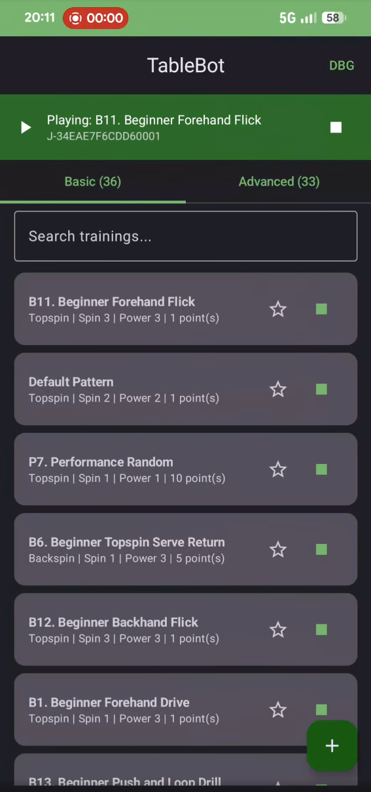

# TableBot

Offline Android app for controlling the Joola Infinity table tennis robot via Bluetooth Low Energy. No internet connection, no accounts, no servers required.

Built because Joola shut down their servers and the official app stopped working.

<a href="https://www.youtube.com/watch?v=xyJTFank78I">
  
</a>

*Tap the screenshot to watch the demo video*

## Status

### Core Robot Control
- [x] BLE connection (alt service `0000FEE7`, legacy `0000FFE0`)
- [x] Basic drill playback with motor control
- [x] Advanced drill playback (multi-ball sequences)
- [x] Full-screen stop overlay with retry until robot confirms
- [x] Reconnect handshake after stop
- [x] Keepalive (CMD 0x04) during playback
- [x] Pre-pattern sequence (STOP → PRE → PATTERN)

### Training Management
- [x] 36 legacy basic drills imported from original app
- [x] 33 legacy advanced drills imported from original app
- [x] Create/edit basic drills (ball type, spin, power, grid, timing)
- [x] Create/edit advanced drills (multi-ball sequences)
- [x] Adjustable ball count (1-100) and ball timing (1-20) for basic drills
- [x] Adjustable repeat count (1-50) and repeat delay for advanced drills
- [x] Favourites
- [x] Search/filter trainings
- [x] Delete trainings
- [ ] Training categories / exercise grouping
- [ ] Skill level filtering (Beginner / Intermediate / Advanced)
- [ ] Import/export drills (file-based)

### Calibration & Fine-Tuning
- [x] Motor config from bundled base-conf (465 entries)
- [x] Calibration screen (per ball/spin/power/position)
- [x] Debug screen with raw motor control
- [ ] Fine adjustment: Adjust Spin per drill (spin gear, side spin gear)
- [ ] Fine adjustment: Adjust Position per drill (X/Y position offset)
- [ ] Per-device motor calibration import/export

### UI & Polish
- [x] Correct naming (Serve/Normal/Lob, spin names, power names)
- [x] Interactive 3x5 table grid with ball number display
- [x] Connection status bar
- [x] Dark/light theme support
- [ ] Proper app icon (currently placeholder green square)
- [ ] Onboarding / first-use guide
- [ ] Training history / session logging
- [ ] Cooldown timer warning (robot suggests 15min break every 2hrs)

### Data Management
- [ ] Import drills from JSON file
- [ ] Export drills to JSON file
- [ ] Import/export motor calibration
- [ ] Backup & restore all data
- [ ] Share drills via file/link

## How it works

The Joola Infinity robot communicates over BLE using a proprietary frame protocol. The protocol was reverse-engineered from:

1. **Smali disassembly** of the original Joola Android app (v2.1.1)
2. **HCI snoop captures** of the original app controlling the robot
3. **Ghidra analysis** of the robot's STM32 firmware

See [PROTOCOL.md](PROTOCOL.md) for the full protocol specification.

## Building

Requires Android SDK with API 34 and JDK 17.

```bash
./gradlew assembleDebug
```

The APK will be at `app/build/outputs/apk/debug/app-debug.apk`.

Install via:
```bash
adb install app/build/outputs/apk/debug/app-debug.apk
```

## Architecture

```
app/src/main/java/com/tablebot/
  ble/
    RobotProtocol.kt    # Frame encoding, CRC-16-CCITT, command builders
    RobotManager.kt     # BLE connection, GATT operations, stop retry loop
  data/
    Models.kt           # Training data classes, ball/spin/power enums
    MotorConfig.kt      # Motor parameter lookup from base-conf
    TrainingStore.kt    # JSON-backed local training storage
  viewmodel/
    RobotViewModel.kt   # Robot connection and drill playback state
    TrainingViewModel.kt# Training list, search, CRUD operations
  ui/
    components/
      ConnectionBar.kt  # BLE status bar with connect/disconnect
      StopOverlay.kt    # Full-screen stop button during playback
      TableGrid.kt      # 3x5 interactive table position grid
    screens/
      HomeScreen.kt     # Main screen with tabs and training lists
      TrainingListScreen.kt  # Basic and advanced training cards
      BasicEditorScreen.kt   # Create/edit basic drills
      AdvancedEditorScreen.kt# Create/edit advanced drills
      CalibrationScreen.kt   # Per-position motor calibration
      DebugScreen.kt         # Raw byte control for testing

app/src/main/assets/
  base-conf.json         # 465 motor config entries (ball/spin/power -> motor speeds)
  basic-trainings.json   # 36 legacy basic drills
  advanced-trainings.json# 33 legacy advanced drills
```

## BLE Protocol Summary

The robot uses an HM-10/CC2541-based BLE module with a custom frame protocol:

- **Service:** `0000FEE7` (alt) or `0000FFE0` (legacy)
- **Write:** `0000FEC7` (Write Without Response)
- **Notify:** `0000FEC8` + `0000FED6` (indications)
- **Frame:** `68 01 [8-byte device ID] 68 [opcode] [length BE] [payload] [CRC-16] 16`
- **Stop:** Opcode `0x99` with payload `0x00` (only command accepted during execution, along with `0x03` and `0x25`)

## Training Parameters

| Parameter | Values |
|-----------|--------|
| Ball Type | Serve (0), Normal (1), Lob (2) |
| Spin | Max Topspin (0), Topspin (1), Float (2), Backspin (3), Max Backspin (4) |
| Power | Extreme (0), Strong (1), Medium (2), Light (3) |
| Grid | 15 positions (3x5 table half) |

## Credits

- [pinfinity](https://github.com/Wolle-Lukas/pinfinity) by Wolle-Lukas for the initial server mock and training data
- Protocol reverse engineering assisted by Claude (Anthropic)

## License

This is a clean-room implementation. No Joola code, assets, or branding is included.
